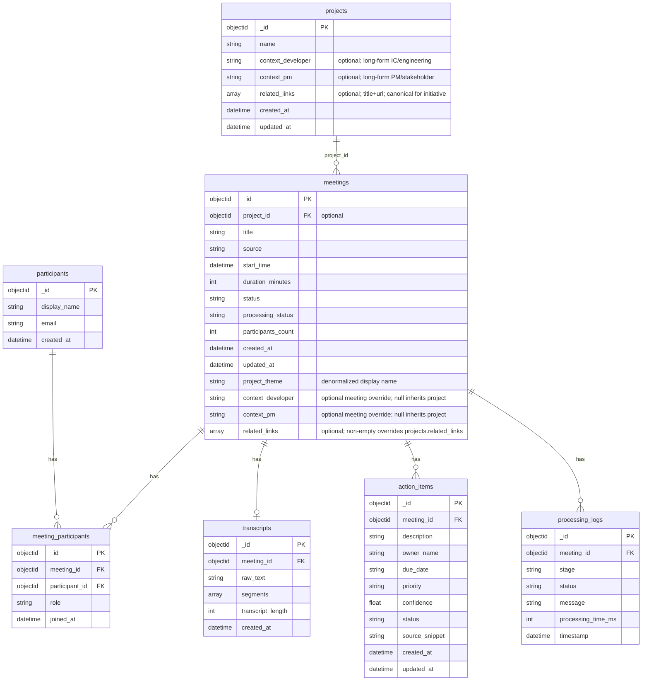

# Database schema (MongoDB)

```mermaid
erDiagram
    projects ||--o{ meetings : "project_id"
    participants ||--o{ meeting_participants : "has"
    meetings ||--o{ meeting_participants : "has"
    meetings ||--o| transcripts : "has"
    meetings ||--o{ action_items : "has"
    meetings ||--o{ processing_logs : "has"

    projects {
        objectid _id PK
        string name
        string context_developer "optional; long-form IC/engineering"
        string context_pm "optional; long-form PM/stakeholder"
        array related_links "optional; title+url; canonical for initiative"
        datetime created_at
        datetime updated_at
    }

    participants {
        objectid _id PK
        string display_name
        string email
        datetime created_at
    }

    meetings {
        objectid _id PK
        objectid project_id FK "optional"
        string title
        string source
        datetime start_time
        int duration_minutes
        string status
        string processing_status
        int participants_count
        datetime created_at
        datetime updated_at
        string project_theme "denormalized display name"
        string context_developer "optional meeting override; null inherits project"
        string context_pm "optional meeting override; null inherits project"
        array related_links "optional; non-empty overrides projects.related_links"
    }

    meeting_participants {
        objectid _id PK
        objectid meeting_id FK
        objectid participant_id FK
        string role
        datetime joined_at
    }

    transcripts {
        objectid _id PK
        objectid meeting_id FK
        string raw_text
        array segments
        int transcript_length
        datetime created_at
    }

    action_items {
        objectid _id PK
        objectid meeting_id FK
        string description
        string owner_name
        string due_date
        string priority
        float confidence
        string status
        string source_snippet
        datetime created_at
        datetime updated_at
    }

    processing_logs {
        objectid _id PK
        objectid meeting_id FK
        string stage
        string status
        string message
        int processing_time_ms
        datetime timestamp
    }
```
